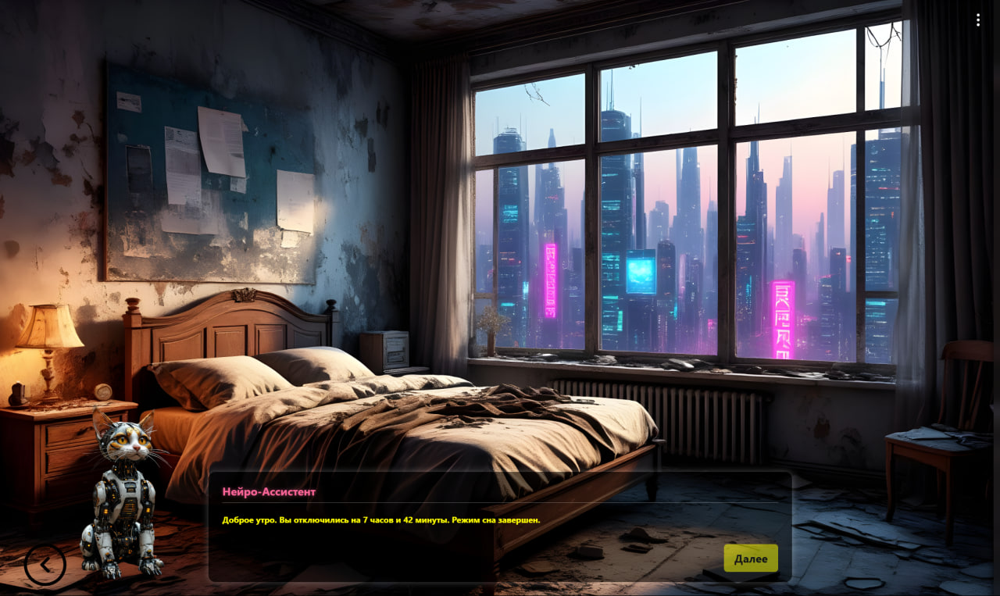
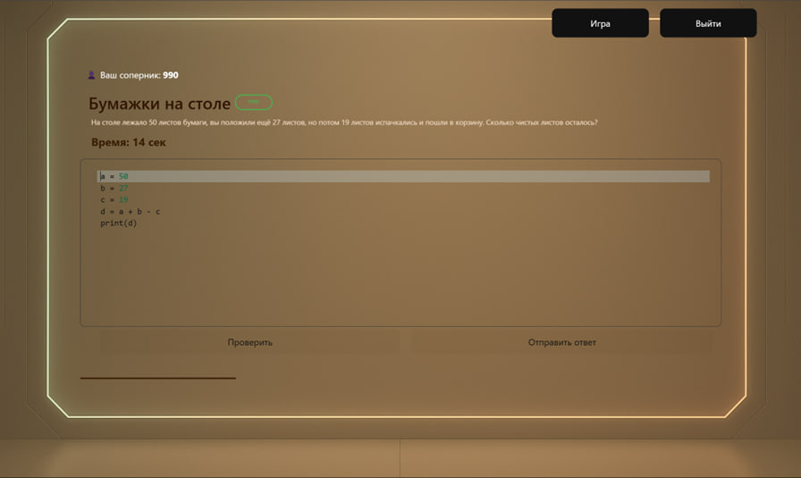
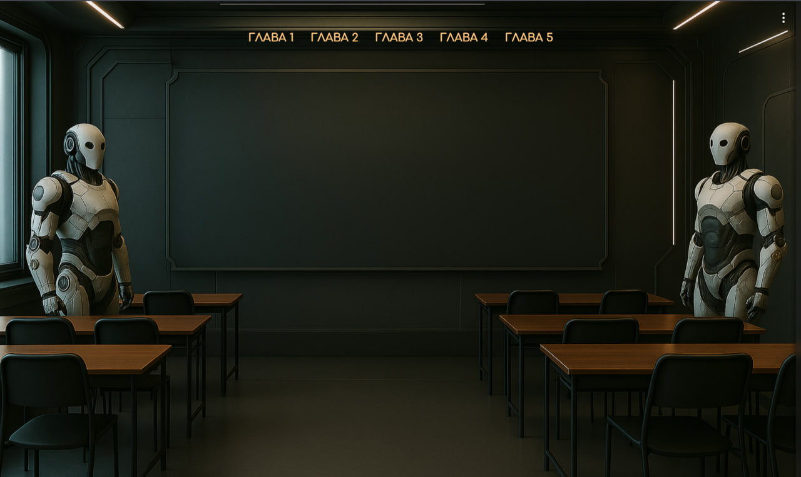
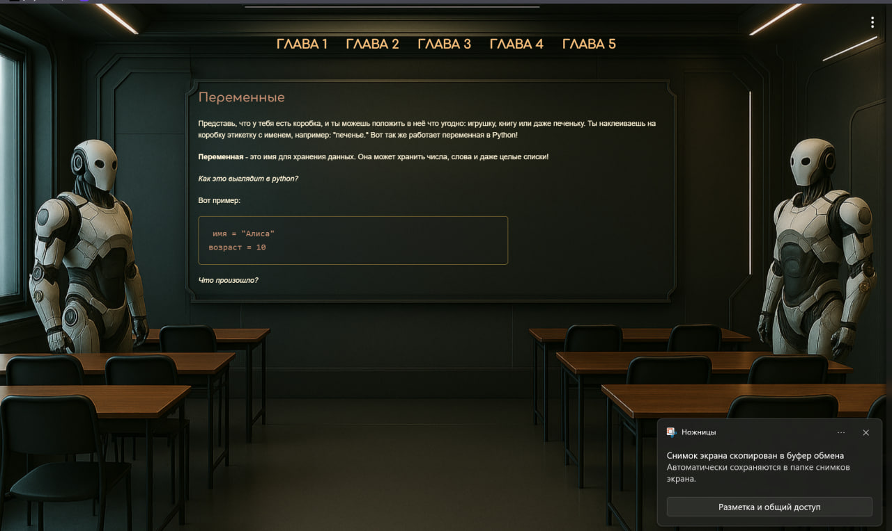
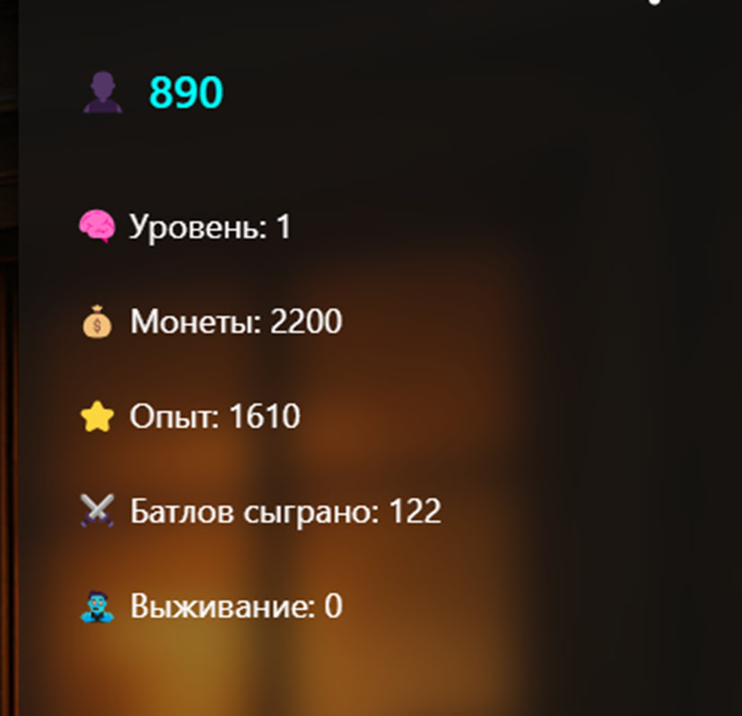
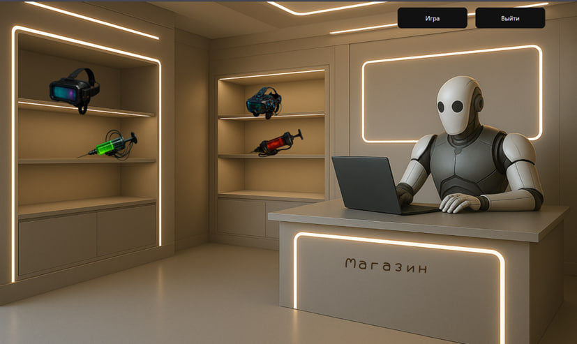

# CodeArena
CodeArena — это онлайн-платформа геймифицированного обучения программированию с элементами RPG и внутриигровой экономикой.  

## Технологии
- **Frontend:** React  
- **Backend:** Node.js, Express  
- **База данных:** PostgreSQL (через Sequelize)  
- **WebSocket:** Socket.io (для режима батлов)  
- **Аутентификация:** JWT (JSON Web Token)

 ## Структура проекта

`/client` — React-приложение, пользовательский интерфейс  
`/server` — Backend на Express с API, WebSocket-сервер и логикой игры

## Установка

Склонируйте репозиторий и установите зависимости в обеих папках:

```bash
git clone https://github.com/username/CodeArena.git
cd CodeArena/client
npm install
cd ../server
npm install
``` 

## Запуск проекта 

Запустите backend и frontend в отдельных терминалах:
# В папке server
`npm run dev` 
# В папке client
`npm start`

Backend будет слушать API-запросы и WebSocket-соединения.
Frontend откроется в браузере и взаимодействует с сервером.

## Использование
- Регистрируйтесь и входите в систему
- Проходите сюжетную линию
- На главной странице(что бы перейти на нее, необходиму кликнуть справа на сайтбаре "игра") можно кликать на вывески и переходить на другие локации
- проходите теорию в школе
- играйте в батлах с соперником
- покупайте усилители

  ## Интерфейс сюжетной линии
  

  ## Интерфейс главной страницы через которые можно переходить в другие локации, нажав на вывески
  

  ## Интерфейс батла и результата батла
  
  

  ## Интерфейс теоретического раздела
  
  

  ## Интерфейс статистики пользователя
    

    ## Интерфейс внутриигрового магазина
    

  ## Контакты
  Автор: Настя Лапинская
Email: anlapinskaya@gmail.com

  
